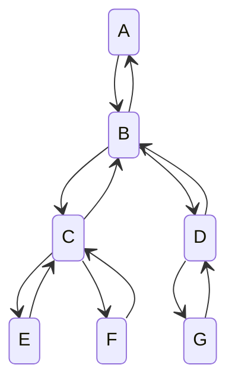

# ROKA_BOJ
전역(23.05.30 ~ 24.11.29)하기 전까지 백준 문제 풀기 및 유형 정리    

# :rocket:알고리즘 시간복잡도 실압근
### STL
- 중복 제거(unique) : unique 자체는 $O(N)$이지만, erase(unique()) 형태면 $O(NM)$
  기본 형태 : ***v1.erase(unique(v1.begin(), v1.end()), v1.end());***

### Graph & Search
- DFS / BFS : $O(V + E)$
- 위상정렬 : $O(V + E)$
- Union-Find : 기본적으로 Find 함수에 의해 시간복잡도가 좌우되며, $O(logN)$, 최악의 경우 $O(N)$이다. 

### Data Structure
- 우선순위 큐 : 삽입, 삭제, front 가져오기 $O(logN)$
- 이분탐색 : $O(logN)$
- 투 포인터 : $O(N)$    

# :rocket:문제 유형 실압근
## Graph
### Flood Fill
### 위상정렬(Topological Sort)
### 다익스트라(Dijkstra)
  
## Tree
### 분리집합(Union Find)
### 최소 스패닝 트리(Minimum Spanning Tree)
  
## DP
### Knapsack Problem
- 0-1 Knapsack Problem
### Tree DP
- 간선의 관계를 이용하는 유형 ([BOJ_7812](https://www.acmicpc.net/problem/7812), [BOJ_20188](https://www.acmicpc.net/problem/20188))

### Graph DP
### LIS
### LCS