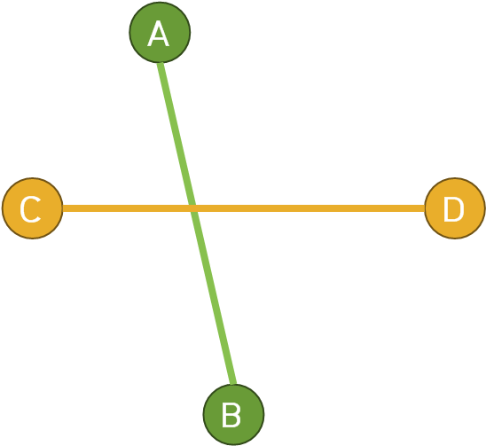
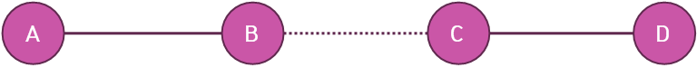
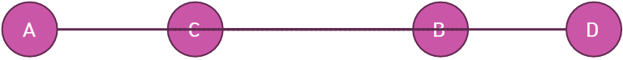
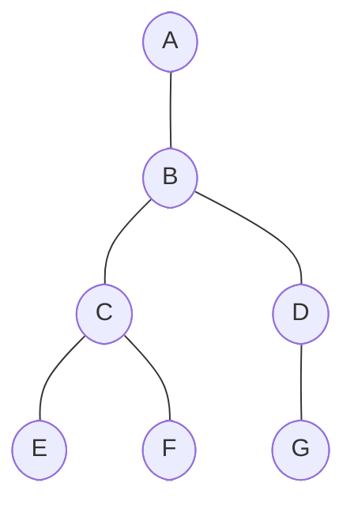

# ROKA_BOJ
전역(23.05.30 ~ 24.11.29)하기 전까지 백준 문제 풀기 및 유형 정리<br/><br/><br/><br/>

# :rocket:알고리즘 시간복잡도 실압근
### C++ STL
- 중복 제거(unique) : unique 자체는 $O(N)$이지만, erase(unique()) 형태면 $O(NM)$
<br/> 기본 형태 : ***v1.erase(unique(v1.begin(), v1.end()), v1.end());***

### Graph & Search
- DFS / BFS : $O(V + E)$
- 위상정렬 : $O(V + E)$
- Union-Find : 기본적으로 Find 함수에 의해 시간복잡도가 좌우되며, 경로압축 기준 $O(a(N))$, 거의 상수 시간 복잡도를 가진다고 봐도 무방하다.

### Data Structure
- 우선순위 큐 : 삽입, 삭제, front 가져오기 $O(logN)$
- 이분탐색 : $O(logN)$
- 투 포인터 : $O(N)$<br/><br/><br/><br/>

# :rocket:문제 유형 실압근
## CCW
- CCW(Counter Clock Wise)



CCW (Counter Clock Wise)는 2차원 평면 위에 놓인 3개의 점에 대해서 어떤 방향성이 있는지 알려주며 이 방향성 정보를 사용해 선분이 서로 교차하는지 판단하게 된다. 일반적으로 CCW 함수는 다음과 같이 구현된다.
```mermaid
int ccw(Point p1, Point p2, Point p3)
{
    ll det = (p2.x - p1.x) * (p3.y - p1.y);
    det -= (p2.y - p1.y) * (p3.x - p1.x);

    if(det > 0LL) return 1;
    else if(det == 0LL) return 0;
    else return -1;
}
```
우선, $\overline{AB}$ 기준에서 교차 여부를 확인해보겠다. </br>
C, A, B의 관계는 $\overrightarrow{CA}$ x $\overrightarrow{AB}$을 해보면 Z축 계수가 음수임을 알 수 있고, 이는 곧 오른손 법칙에 의해 시계 관계임을 알 수 있다.
D, A, B는 $\overrightarrow{DA}$ x $\overrightarrow{AB}$ 결과 Z축 계수가 양수가 나오고 이는 곧, 반시계 관계임을 알 수 있다. 또한, 세 점이 직선상에 놓일 경우 Z축의 계수는 0이 나온다.<br/>
우리는 Z축 계수의 값은 필요없고 세 점의 관계에 대한 정보만 필요하니 반시계일 경우는 1, 직선상에 놓이면 0, 시계면 -1을 리턴한다.

즉, CCW(C, A, B) * CCW(D, A, B) <= 0을 만족하니 두 직선은 교차한다 볼 수 있다.


하지만, 위와 같은 경우 CCW(A, C, D) * CCW(B, C, D) <= 0을 만족하지만, 교차하지 않는다. 즉,  한 직선을 통해서만 교차 여부를 파악하는 것이 아닌,  다른 직선을 통해서도 교차 여부를 파악해야한다. CCW(C, A, B) * CCW(D, A, B) <= 0을 만족하지 않으므로 결과적으로  $\overline{AB}$와  $\overline{CD}$는 서로 교차하지 않는다.

즉, 
```CCW(A, C, D) * CCW(B, C, D) <= 0 && CCW(C, A, B) * CCW(D, A, B) <= 0```를 만족해야 두 선이 교차한다 볼 수 있다. 하지만 우린 또 하나의 예외처리를 해줘야 한다.
</br></br></br>

</br></br></br></br>

```CCW(A, C, D) * CCW(B, C, D) == 0 && CCW(C, A, B) * CCW(D, A, B) == 0```인 경우인데, A좌표와 B좌표 중 가장 큰 값과 C좌표와 D좌표 중 가장 큰 값이, 서로의 작은 값보다 크면 교차한다. 즉, A좌표와 B좌표 중 가장 큰 값을 B로, C좌표와 D좌표 중 가장 큰 값을 D로 둘 때 ```B >= C && D >= A```를 만족하면 교차한다. 

## Graph
### Flood Fill
### 위상정렬(Topological Sort)
### 다익스트라(Dijkstra)
<br/><br/>
## Tree
### 분리집합(Union Find)
### 최소 스패닝 트리(Minimum Spanning Tree)
<br/><br/>
## DP
### Knapsack Problem
- 0-1 Knapsack Problem
### Tree DP
- 임의의 간선을 지나는 횟수를 이용하는 유형 ([BOJ_7812](https://www.acmicpc.net/problem/7812), [BOJ_20188](https://www.acmicpc.net/problem/20188))


A가 루트인 트리에서 임의의 한 정점으로부터 다른 모든 정점까지의 거리의 합을 구하기<br/>
(N : 정점의 개수, weight : 간선의 길이, subTree[x] : x가 루트인 서브트리의 정점 개수)
    
우선, basis로 쓸 dist[A]를 누적합으로 미리 구한다.

B to Others를 구할 때 C를 제외한 나머지 간선들의 방문 횟수와 C to Others를 구할 때 B를 제외한 나머지 간선들의 방문 횟수는 일치한다. 
B to Others 기준 B-C를 지나는 횟수는 subTree[C], C to Others 기준 B-C를 지나는 횟수는 N - subTree[C]이므로 DFS로 구현하면 점화식은 다음과 같다.

    dist[child] = dist[parent] + (N - 2 * subTree[child]) * weight
    

### Graph DP
### LIS
